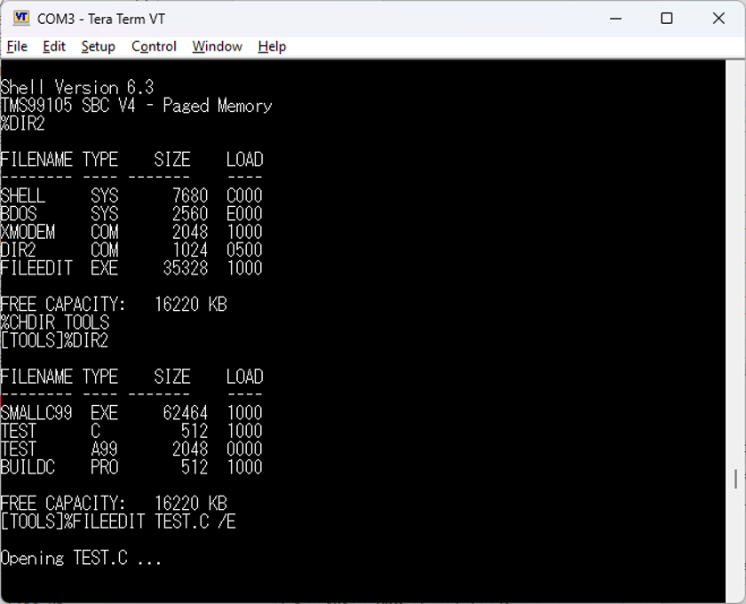

# SHELL V6.3.5 — TMS99105 SBC

---

Command interpreter for the TMS99105 SBC V4 (paged memory), sitting between
the BDOS 6.1 folder-aware filesystem and the user. Assembled with A99, loaded 
at `>C000` as `SHELL.SYS`.

---

## What it does

- Prompts, reads a command line, and runs it — internal command, `.COM`,
  `.EXE`, or `.PRO` procedure file.
- Tracks the active working directory and provides a dynamic context-aware prompt 
  (e.g., `[TOOLS]%`).
- Owns the low-memory interface that applications use: command line, FCB,
  sector buffer, free-memory and memory-limit cells.
- Sets up and tears down the paging state around every application launch.
- Interprets procedure files — batch scripts with parameters, comments,
  echo control and single-step, completely decoupled from the application FCB.

---

## Memory map

| Address | Label | Purpose |
| --- | --- | --- |
| `>0080` | `SHELL_PTR` | `B @RGATE` — how an application returns |
| `>0084` | `BDOS_PTR` | BDOS entry gateway |
| `>00A0` | `CMDL_PTR` | pointer to the raw command line |
| `>00A2` | `CMDL_SIZE` | its length |
| `>00A4` | `BUFF_PTR` | pointer to the common sector buffer |
| `>00A6` | `FREEMEM` | first free byte above the loaded image |
| `>00AC` | `FCB_PTR` | pointer to the common FCB |
| `>00B0` | `MEMLIMIT` | top of usable memory for the application |
| `>0230` | `SH_WP` | shell workspace, R0–R15 |
| `>0250` | `SH_CMD` | command line, raw input string |
| `>0280` | `CM_FCB` | standard FCB, 36 bytes |
| `>----` | `PROC_FCB` | dedicated engine FCB for procedure files |
| `>02A4` | `CM_VARS` | bridge variables, pointers, status flags |
| `>0300` | `CM_BUF` | 512-byte sector buffer / LOADERCODE area |
| `>0FFE` | `STACKP` | stack, grows down |
| `>C000` | `SHELL` | the shell itself |

Paging (Rev 24Q hardware):

- Segment 0 (`>0000`–`>0FFF`) — COMMON, forced to physical page 0
- Segments 1–E (`>1000`–`>EFFF`) — PAGED, selected by the 6116 map registers
- Segment F (`>F000`–`>FFFF`) — ROM, forced to physical page 0

The 6116 mapper is programmed over the CRU with `LDCR`/`STCR`. The `PSEL`
XOPs enable and disable the GAL page-select output. Segments C and D run on
physical page 1 while an application executes, so the shell's own pages are
hidden from it and restored on return.

---

## Directories and Folders

With the introduction of BDOS 6.1, the filesystem supports compartmentalized 
subfolders, allowing users to organize files beyond the traditional flat directory. 
This is achieved via a 256-slot Folder Alias Table located at Block 7 on the disk.

- **Creating Folders:** `MKDIR <name>` generates a new folder entry and assigns 
  it a unique 8-bit ID. Any files saved while inside this folder are stamped with this ID.
- **Navigating Folders:** `CHDIR <name>` switches the active directory environment. 
  The Shell tracks this state and updates the prompt dynamically (e.g., `[TOOLS]%`).
- **Returning to Root:** Typing `CHDIR` with no arguments returns the user to the Root directory (`%`).
- **Context-Aware Listings:** The `DIR` command automatically filters its output 
  based on the current active folder.

### "BDOS" Root Fallback
To prevent duplicating system utilities (like `XMODEM` or `FILEEDIT`) into every folder, 
the Shell utilizes a "BDOS" fallback architecture. If an external command is typed 
and cannot be found in the current subfolder, the Shell safely overrides the search target 
to `00` (Root) via FCB offset 18. This allows utilities residing in the Root directory to 
be executed globally from within any subfolder without altering the user's working directory state.  This feature is demonstrated in the screenshot below.

---

## Command lookup

A bare command name is resolved by walking `EXEC_TAB` in precedence order:

1. `.COM` — flat image, loaded at the directory entry's load address (FLA)
2. `.EXE` — paged image with an overlay chain
3. `.PRO` — procedure file, interpreted rather than loaded

An explicitly typed extension is used as typed. The file type comes from the
directory entry (`FTY`, FCB offset 11), not from the extension, so
`SEARCH1`/`FOPEN` decide what happens rather than the name.

Type codes match the BDOS: `SYS=0 COM=1 EXE=2 TXT=3 BAS=4 PRO=5`.

### Internal commands

| Command | Purpose |
| --- | --- |
| `DIR` | directory listing (aware of current folder) |
| `MKDIR` | create a new subfolder in the Alias Table |
| `CHDIR` | change working directory (no arguments returns to Root) |
| `SAVE` | write memory to a file: `SAVE <sectors> <name> [-HHHH]` |
| `ERA` | erase a file |
| `TYPE` | list a text file |
| `LOAD` | load without running |

A leading `.` on any command line loads without running.

---

## Procedure files

A procedure is an ordinary text file whose directory type is `PRO`. It is
never loaded into memory — the shell reads it one 512-byte record at a time
and feeds each assembled line to the command dispatcher, exactly as if it had
been typed.

### Syntax

| Form | Meaning |
| --- | --- |
| `command args` | run it |
| `: text` | comment, discarded |
| `_ text` | echo the line, don't run it |
| `__` | wait: prompt, then `CR` continues, `^C` aborts, `^S` skips the next line |
| `$0`–`$9` | substitute a parameter from the invoking command line |
| `-V` | echo every line as it runs |
| `-N` | fetch but never execute — with `-V`, a listing |

Lines must fit the command line buffer. A comment counts against the same
budget as a command.

Any failing command ends the procedure. So does end of file, `^C` at a wait,
a read error, or running out of records.

### How it runs

- **Entry** — `LOOK` opens the file, records its size, reads `FTY` from the
  FCB and branches to `DOPROC` when it is `PRO`.
- **`DOPROC`**, once per procedure — refuses to nest, sets `PROCSW` (which is
  what makes the shell fetch its next line from the file instead of
  prompting), resets the record cursor, initializes the dedicated `PROC_FCB`, takes
  its own record count in `PRECS`, and parses the invoking line into `PBUF`
  and `PPTRS` for `$n` substitution.
- **`PFETCH`**, once per record — targets `PROC_FCB` directly to read into
  `PRBUF` without disturbing the global `CM_FCB`.
- **`BUFMOVE`**, once per character — assembles a line, terminating on `CR`;
  `LF` is discarded, and `>00`, `>FF` or `^Z` end the procedure.
- **`PEOL`**, once per line — applies the comment, echo, `-V`, `-N` and wait
  rules, then hands the line to `DOCMD`.
- **`UNPROC`** clears `PROCSW` and returns to the prompt.

---

## Building

    A99 SHELLV63_5.A99

Produces an Intel HEX image at `>C000`. Transfer with the monitor's hex
loader, or convert with `hex2com` and send by XMODEM.

---

## Revision history

Kept in full at the head of `SHELLV63_5.A99`. Recent work:

- **6.3.5** — Folder-aware BDOS 6.1 integration with `MKDIR` and `CHDIR` support. Dynamic prompt tracking `[FOLDER]%`. "Clever BDOS" Root Fallback allows utilities to execute from Root while deep in a subfolder. `PROC_FCB` introduced to completely decouple the procedure engine's read cursor from the execution FCB. Fixed `PARSENAME` null-padding and sticky root overrides.
- **6.3** — raw COM contract; C and D on physical page 1 during execution,
  with a common BDOS gateway that disables PSEL for the whole call.
- **6.3** — command lookup rewritten. Type now read from the FCB instead of wildcard assumptions.
- **6.3** — procedure processing connected. `DOPROC` sets `PROCSW`, fetch engine reachable, private record buffer, own record count.
