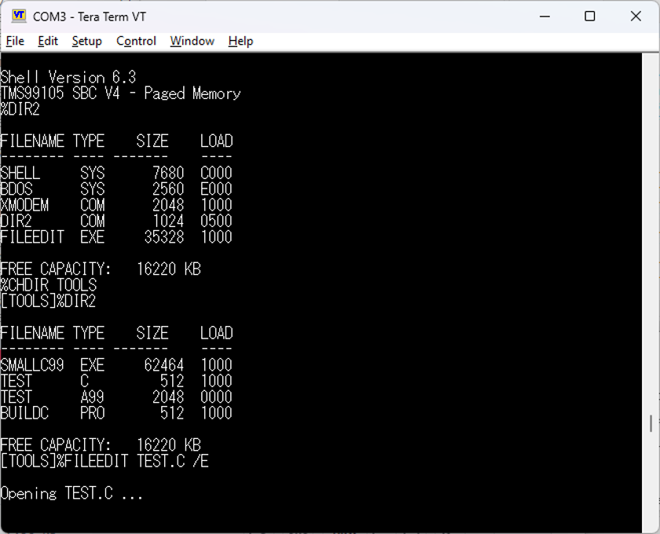

# SHELL V6.5 — TMS99105 SBC

---

Command interpreter for the TMS99105 SBC V4 (paged memory), sitting between
the BDOS 6.1 folder-aware filesystem and the user. The core is assembled with
A99 and loaded at `>C000` as `SHELL.SYS`; each internal command is a separate
program that lives in its own physical memory page.

---

## What it does

- Prompts, reads a command line, and runs it — internal command, `.COM`,
  `.EXE`, or `.PRO` procedure file.
- Tracks the active working directory and shows it in the prompt
  (e.g. `[TOOLS]%`).
- Owns the low-memory interface that applications use: command line, FCB,
  sector buffer, free-memory and memory-limit cells.
- Sets up and tears down the paging state around every application launch.
- Keeps every internal command resident in its own 4K page, loaded once at
  cold start — no disk access when a command runs, and each command can grow
  to a full 4K without touching the core or any other command.
- Interprets procedure files — batch scripts with parameters, comments,
  echo control and single-step, completely decoupled from the application FCB.
- Protects the system files: `ERA`, `SAVE` and `REN` never erase, overwrite
  or rename a `.SYS` or `.SHC` file, and `COPY` never copies over one.

---

## Memory map

| Address | Label | Purpose |
| --- | --- | --- |
| `>0080` | `SHELL_PTR` | `B @RGATE` — how an application returns |
| `>0084` | `BDOS_PTR` | `B @BGATE` — BDOS entry for applications |
| `>00A0` | `CMDL_PTR` | pointer to the raw command line |
| `>00A2` | `CMDL_SIZE` | its length |
| `>00A4` | `BUFF_PTR` | pointer to the common sector buffer |
| `>00A6` | `FREEMEM` | first free byte above the loaded image |
| `>00AC` | `FCB_PTR` | pointer to the common FCB |
| `>00B0` | `MEMLIMIT` | top of usable memory for the application |
| `>0230` | `SH_WP` | shell workspace, R0–R15 |
| `>0250` | `SH_CMD` | command line, raw input string |
| `>0280` | `CM_FCB` | standard FCB, 36 bytes |
| `>02A0` | `CM_VARS` | overlay manager variables; `>02A4`–`>02DF` is also `COPY`'s scratch (destination FCB and the two folder names) |
| `>02E8` | `LGATE` | launch gate: `PSEL_EN` / `B *R8` |
| `>02F0` | `RGATE` | return gate: `PSEL_DIS` / `B @RETURN` |
| `>02F6` | `BGATE` | BDOS gate: `PSEL_DIS` / `CALL @BDOS` / `PSEL_EN` / `RET` |
| `>0300` | `CM_BUF` | 512-byte sector buffer / LOADERCODE area |
| `>0500` | `TPA` / `STAGING` | default COM load address / sector staging buffer |
| `>0FFE` | `STACKP` | stack, grows down |
| `>C000` | `SHELL` | the shell core (`>C000`–`>D358`) |
| `>D000` | — | command window: the running internal command's page |
| `>D020` | `PROC_FCB` | dedicated FCB for procedure files (in the shell's own page) |
| `>E000` | `BDOS` | BDOS entry |

Paging (Rev 24Q hardware):

- Segment 0 (`>0000`–`>0FFF`) — COMMON, forced to physical page 0
- Segments 1–E (`>1000`–`>EFFF`) — PAGED, selected by the 6116 map registers
- Segment F (`>F000`–`>FFFF`) — ROM, forced to physical page 0

The 6116 mapper is programmed over the CRU with `LDCR`/`STCR`. The `PSEL`
XOPs enable and disable the GAL page-select output: with PSEL off every
segment reads physical page 0 ("flat"); with PSEL on the map registers apply.
The BDOS always runs flat. Segments C and D run on physical page 1 while an
application executes, so the shell's own pages are hidden from it and
restored on return.

---

## Internal commands

| Command | Purpose |
| --- | --- |
| `DIR` | directory listing of the active folder |
| `TYPE <file>` | list a text file, pausing every 22 lines (space = next page, Enter = run on, Esc/^C = stop) |
| `ERA <file>` | erase files — wildcards allowed: `ERA *.A99`, `ERA TEST.*`, `ERA T*.A99`, `ERA ?1.*` |
| `REN <old> <new>` | rename a file (exact names only) |
| `COPY <src> <dst>` | copy one file; either name may carry a `[FOLDER]` prefix (exact names only) |
| `SAVE <sectors> <file> [-HHHH]` | write memory to a file, from `>0500` or from address `HHHH` |
| `LOAD <file>` | load an EXE into its pages without running it |
| `MKDIR <name>` | create a folder |
| `CHDIR <name>` | change folder; `CHDIR` alone returns to Root |
| `RMDIR <name>` | remove an empty folder |

A leading `.` on any command line loads without running.

### DIR

    DIR

- Lists every file in the active folder, four names to a row, each name shown
  as its 11 raw characters (8 name, 3 extension, no dot).
- Takes no argument; anything after `DIR` is ignored.
- An empty folder shows `NO FILES`.
- For sizes and load addresses use the `DIR2` utility in Root.

### TYPE

    TYPE <file>

- Lists a text file on the console, stopping at end of file or at `^Z`.
- Pauses every 22 lines (`PGLINE`) and waits for a key:
  - **Space** — the next page;
  - **Enter** — the rest of the file without pausing;
  - **Esc** or **^C** — stop.
- A missing file shows `NO FILES`; no name gives `--Parse error`.
- Bytes are sent as they are — see Known issues for LF-only files.

### ERA

- A plain name erases that one file.
- A wildcard erases every match in the active folder and lists each file as
  it goes. `*` fills the rest of the name or extension with `?`.
- `ERA *.*` asks `Erase ALL files in this folder (Y/N)?` first.
- Matches are collected first and erased afterwards, so the BDOS search is
  never disturbed by an erase. Up to 200 files per run; if more match, ERA
  says so and you run it again.

### REN

    REN <old> <new>

- Renames a file in the active folder. Both names must be exact.
- `?File not found` — the old name does not exist.
- `?Name already in use` — the new name is taken.
- Refuses a `.SYS` or `.SHC` file as either name, and wildcards
  (`--REN needs exact names, no wildcards`).
- A missing name gives `--Parse error`.

### COPY

    COPY <src> <dst>
    COPY TEST.C T2.C
    COPY [TOOLS]LANGTEST.C LT.C
    COPY DIR2.COM [TOOLS]DIR2.COM

- Copies one file, sector by sector. A name without a `[FOLDER]` prefix is in
  the current folder; `COPY [TOOLS]ABC.EXE DEF.COM` puts `DEF.COM` in the
  current folder, not in `TOOLS`.
- An existing destination is replaced.
- The copy keeps the source's load address (`FLA`), type byte (`FTY`) and
  last-record length (`LRBL`), so a copied `.COM` loads and runs like the
  original.
- Refuses, with a message:
  - wildcards in either name (`?` is a real wildcard in the BDOS search);
  - a `.SYS` or `.SHC` destination (see System file protection);
  - a file copied onto itself — detected by both names opening to the same
    first block, so it is caught through folders too;
  - a missing source or folder.
- A write or close failure erases the partial destination rather than leave a
  truncated file.
- The shell's current folder is restored on every exit.

How it handles folders: the BDOS resolves an FCB's folder when it is called
(FCB byte 18 `>20` means "the active folder"), so `COPY` parses both names
first, then works on each file with its own folder active. The source is
opened in its folder; after that its reads follow its block chain. The
destination is checked, erased, made, written and closed in its folder — a
Root file's folder ID is 0, which the BDOS also reads as "the active folder",
so the destination's folder must still be active at `FCLOSE`.

### SAVE

    SAVE <sectors> <file> [-HHHH]
    SAVE 8 PROG.COM
    SAVE 16 IMAGE.COM -2000

- Writes `<sectors>` 512-byte records of memory to `<file>`, starting at
  `>0500` (the TPA) or at the hex address given with `-HHHH`.
- The sector count is decimal and the address hex; a count of 0, or an
  address of 0, is a parse error.
- The start address becomes the file's load address (`FLA`), so a saved
  `.COM` loads back where it came from.
- An existing file of that name is replaced.
- Stops with `--File too large error` if the data would reach `MEMLIMIT`;
  `--Make error` or `--Write error` if the BDOS fails.
- Refuses a `.SYS` or `.SHC` name and wildcards
  (`--SAVE needs one exact file name, no wildcards`).

### LOAD

    LOAD <file>

- Loads an EXE into its pages without running it — each block is listed
  (`BLK PG:` page, address, size) as it is copied, then `Loaded as overlay`.
- `--Load error` if the file cannot be opened or read;
  `--EXE block overlaps shell memory` for a block at or above `>C000`.
- Has known limitations (see Known issues).

### MKDIR

    MKDIR <name>

- Creates a folder; the name follows the same rules as a file name.
- `--Directory creation failed` if the BDOS refuses it; no name gives
  `--Parse error`.

### CHDIR

    CHDIR <name>
    CHDIR

- Makes `<name>` the active folder and shows it in the prompt
  (e.g. `[TOOLS]%`). `CHDIR` alone returns to Root (`%`).
- `--Directory not found` if there is no such folder; the active folder is
  then unchanged.

### RMDIR

    RMDIR <name>

- Removes a folder.
- `--RMDIR Error: Not found, in use, or not empty` if the BDOS refuses it;
  no name gives `--Parse error`.

### System file protection

`.SYS` and `.SHC` files are the shell, the BDOS and the command pages — lose
one and the next boot fails. So:

- `ERA` never erases them, by wildcard or by full name.
- `SAVE` never writes to one, and `REN` never renames one away or renames
  anything to one.
- `COPY` never copies over one; copying *from* one (a backup) is allowed.
- `SAVE`, `REN` and `COPY` refuse wildcard names, since those could reach a
  system file indirectly.

System files are added or removed only by rebuilding the volume with SYSGEN.

---

## Internal commands in pages

Each internal command is its own source file, assembled at `AORG >D000` and
stored on the disk as `NAME.SHC` in the Root folder. At cold start `LDCMDS`
reads each one into its own physical page of segment D:

| Page | 2 | 3 | 4 | 5 | 6 | 7 | 8 | 9 | 10 | 11 |
| --- | --- | --- | --- | --- | --- | --- | --- | --- | --- | --- |
| Command | DIR | SAVE | ERA | TYPE | LOAD | MKDIR | CHDIR | RMDIR | REN | COPY |

A command uses only the `>D000`–`>DFFF` part of its physical page, so it does
not conflict with an EXE's overlays, which use `>8000`–`>BFFF` of the same
pages.

A file that is missing, empty, larger than 4096 bytes, or does not start with
`B @` is reported at boot (`--Cannot load command`) and that command is refused
cleanly rather than run.

When a command is typed, `ICMD` finds it in `ICLIST`, maps segment D to its
page, turns PSEL on and branches to `>D000`. Segment C still shows the core,
so the command calls core routines directly. It reaches the BDOS through the
gate at `>02F6`, which turns PSEL off for the call and back on afterwards
without touching the map. `RETURN` and `NEXTCMD` turn PSEL off and put D back
on the shell's own page.

### Rules for a command page

- `INCL "C:DECLS.INC"` then `INCL "C:CORE.INC"`, then `AORG >D000`.
- The first instruction must be `B @entry`.
- Exit by branching into the core — `RETURN`, `NEXTCMD` or an error exit;
  never return, never call another command.
- Never execute `PSEL_DIS` and never remap segment D.
- Everything the page uses — code, data and `BSS` — must fit `>D000`–`>DFFF`.
  The stack is the shell's, in segment 0.
- Anything the BDOS reads or writes — FCBs, names, sector buffers — must be
  in common memory below `>C000`: the BDOS runs with PSEL off and cannot see
  the page.
- Keep nothing in registers across a BDOS call: some functions (`FCHDIR`,
  for one) change most of R0–R8.
- Core addresses at or above `>D000` are invisible from a page (they are in
  the shell's own page D0). `CORE.INC` does not export them, so naming one is
  an assembly error, not a silent wrong read.

### Adding a command

1. Write `NAME.A99` following the rules above.
2. Add an entry to `ICLIST` in `SHELLV65.A99` with the next free page number,
   and increment `CMDCNT`.
3. Add the name to `PAGES` and the `NAME.SHC=NAME.H99` pair to the SYSGEN line
   in `MAKESHELL.bat`.

---

## Directories and Folders

With the introduction of BDOS 6.1, the filesystem supports compartmentalized
subfolders, allowing users to organize files beyond the traditional flat directory.
This is achieved via a 256-slot Folder Alias Table located at Block 7 on the disk.

- **Creating Folders:** `MKDIR <name>` generates a new folder entry and assigns
  it a unique 8-bit ID. Any files saved while inside this folder are stamped with this ID.
- **Navigating Folders:** `CHDIR <name>` switches the active directory environment.
  The Shell tracks this state and updates the prompt dynamically (e.g., `[TOOLS]%`).
- **Returning to Root:** Typing `CHDIR` with no arguments returns the user to the Root directory (`%`).
- **Removing Folders:** `RMDIR <name>` removes a folder once it is empty.
- **Context-Aware Listings:** The `DIR` command automatically filters its output
  based on the current active folder.
- **Copying between folders:** `COPY [TOOLS]X.C [WORK]X.C` copies a file from
  one folder to another without changing the working directory.

### Root Fallback
To avoid duplicating system utilities (like `XMODEM` or `FILEEDIT`) into every folder,
the Shell falls back to Root: if an external command is typed and cannot be found in the
current subfolder, the Shell sets the search target at FCB offset 18 to `>FE` (explicit
Root) and searches again. Utilities in Root can therefore be run from inside any
subfolder without changing the working directory. The command pages themselves are
always read from Root in the same way.

---

## Command lookup

Internal commands are matched first. Otherwise a bare command name is resolved
by walking `EXEC_TAB` in precedence order:

1. `.COM` — flat image, loaded at the directory entry's load address (FLA)
2. `.EXE` — paged image with an overlay chain
3. `.PRO` — procedure file, interpreted rather than loaded

An explicitly typed extension is used as typed. The file type comes from the
directory entry (`FTY`, FCB offset 11), not from the extension, so
`SEARCH1`/`FOPEN` decide what happens rather than the name.

Type codes match the BDOS: `SYS=0 COM=1 EXE=2 TXT=3 BAS=4 PRO=5`.

---

## Procedure files

A procedure is an ordinary text file whose directory type is `PRO`. It is
never loaded into memory — the shell reads it one 512-byte record at a time
and feeds each assembled line to the command dispatcher, exactly as if it had
been typed. Lines are converted to upper case.

Run one by name with its arguments, and optionally `-V` or `-N`:

    T -V TEST.C

### Syntax

| Form | Meaning |
| --- | --- |
| `command args` | run it |
| `: text` | comment, discarded |
| `_ text` | display the line, don't run it |
| `__` | wait: prompt, then `CR` continues, `^C` aborts, `^S` skips the next line |
| `$1`–`$9` | substitute an argument from the invoking command line |
| `$0` | substitute the procedure's own name |
| `$$` | a literal `$` |
| `-V` | echo every line as it runs |
| `-N` | fetch but never execute — with `-V`, a listing |

A `$n` that was not given substitutes nothing. Lines must fit the command line
buffer; a comment counts against the same budget as a command.

A procedure ends at end of file, `^C` at a wait, or a shell error (unknown
command, line too long, too many parameters, read error). It does **not** end
when a program or internal command reports its own failure — the next line
runs (see Known issues).

### Example

    : T.PRO - show a file, wait, then list the folder
    _ Typing $1
    TYPE $1
    __
    DIR

### How it runs

- **Entry** — `LOOK` opens the file, records its size, reads `FTY` from the
  FCB and branches to `DOPROC` when it is `PRO`.
- **`DOPROC`**, once per procedure — refuses to nest, sets `PROCSW` (which is
  what makes the shell fetch its next line from the file instead of
  prompting), resets the record cursor, initializes the dedicated `PROC_FCB`,
  takes its own record count in `PRECS`, clears and fills `PPTRS`/`PBUF` for
  `$n` substitution.
- **`PFETCH`**, once per record — reads through `PROC_FCB` into `PRBUF`
  without disturbing the global `CM_FCB`.
- **`BUFMOVE`**, once per character — assembles a line, terminating on `CR`;
  `LF` is discarded, and `>00`, `>FF` or `^Z` end the procedure.
- **`PEOL`**, once per line — applies the comment, display, `-V`, `-N` and
  wait rules, then hands the line to `DOCMD`.
- **`UNPROC`** clears `PROCSW` and returns to the prompt.

All procedure state lives in the shell's own page, so neither the command
pages nor applications can disturb it between lines.

---

## Building

### Repository layout

| Folder | Contents |
| --- | --- |
| `SHELL/` | `SHELLV65.A99` (core), `DECLS.INC`, the ten command pages, `MAKESHELL.bat`, `sysgen.c` |
| `MKCINC/` | the `CORE.INC` generator — built separately, `MKCINC.EXE` copied into `SHELL/` |
| `A99/` | the A99 cross-assembler (ANSI C) with `INCL` |
| `A99_K&R/` | the same assembler in K&R / Small C 2.2 style, for SMALLC99 on the SBC |

### Source files

- **`DECLS.INC`** — hand-maintained declarations shared by the core and every
  page: registers, XOPs, memory map, BDOS function codes, FCB offsets. It
  never declares `BDOS`: the core calls the real one at `>E000`, the pages the
  gate.
- **`CORE.INC`** — generated by `MKCINC` from the core's listing: the addresses
  of routines and data inside the core, plus `BDOS` equated to the gate.
  Addresses `>D000`–`>DFFF` are withheld.

### Build

Put `A99.EXE`, `MKCINC.EXE`, `DSKINIT62.H99`, `BDOS61.H99`, `XMODEM59.H99`
and `DIR2.H99` in `SHELL/`, with MinGW `gcc` on the PATH, and run:

    MAKESHELL

It builds `SYSGEN`, assembles the core, generates `CORE.INC`, assembles the
ten pages, packs the volume into `PAYLOAD65.HEX` with SYSGEN, and copies it
to `..\MONITOR`. It stops at the first error and copies nothing unless every
step is clean. Each assembly's output is kept in `<name>.LOG`.

Upload `PAYLOAD65.HEX` with the monitor's hex loader. This rebuilds the whole
volume.

- `SHELL.SYS` and `BDOS.SYS` must stay directory entries 0 and 1 — the boot
  loader finds them by position.
- Changing the core moves its addresses: always run the full `MAKESHELL`.
  Changing one command only affects its own page.

---

## Known issues

- **`LOAD`**: does not clear stale page mappings before loading, maps only a
  block's starting segment, copies words (an odd byte count loses the last
  byte; a count of 0 or 1 runs away), and does not detect a failed open.
- **Procedures**: `RETURN` was meant to end a procedure when a program exits
  with `-1`, but its test always falls through, so the procedure continues.
- **`TYPE`**: sends bytes as they are; a file with LF-only line endings
  (e.g. made on Linux) displays as a staircase. Convert it to CRLF first.
- **`COPY`**: the BDOS's `RDSEQ` returns `-1` both at end of file and on a
  read error, so a read error part-way through ends the copy early without a
  message. One file per command; no wildcard copies.
- **`CMDCNT`** is maintained by hand when a command is added.

---

## Revision history

Kept in full at the head of `SHELLV65.A99`. Recent work:

- **6.5c** — `COPY` added (page 11): one file, `[FOLDER]` prefixes on either
  name, keeps load address and type, refuses wildcards, system-file
  destinations and a file copied onto itself. EXE loader: the 144-record block
  log (`DBG_LOG`) and the `-D` load map are removed — the log overflowed for
  any EXE of more than 144 blocks and overwrote shell variables. The loader
  now works out `FREEMEM` and `MEMLIMIT` as it loads, with no block limit.
  Core drops from `>D911` to `>D358` (1,474 bytes returned).
- **6.5b** — System file protection: `ERA`, `SAVE` and `REN` never erase,
  overwrite or rename `.SYS`/`.SHC`, and `SAVE`/`REN` refuse wildcards.
  `SAVE` now detects a failed make or write.
- **6.5a** — `ERA` wildcards (`ERA *.A99` etc.), with confirmation for `*.*`.
  Procedure engine repaired: `$n` substitution never worked; `DOPROC` clears
  stale parameters; the `__` wait called address `>0001`; `-V` doubled its
  line feeds. `$0` = procedure name, `$$` = `$`.
- **6.5** — Internal commands moved out of the core into their own 4K pages
  in segment D, loaded at cold start by `LDCMDS`, run through `ICMD` with PSEL
  on and the BDOS reached through the gate. Core drops from 7660 to 6418
  bytes. Build split into `DECLS.INC` + generated `CORE.INC`; A99 gains `INCL`.
  `MKERR` no longer drops into the monitor. `LOAD` refuses blocks at or above
  `>C000`.
- **6.4** — EXE loader refuses any block that would land at or above `>C000`
  (`--EXE block overlaps shell memory`).
- **6.3.5** — Folder-aware BDOS 6.1 integration with `MKDIR` and `CHDIR`
  support. Dynamic prompt tracking `[FOLDER]%`. Root fallback allows utilities
  to execute from Root while deep in a subfolder. `PROC_FCB` introduced to
  decouple the procedure engine's read cursor from the execution FCB. Fixed
  `PARSENAME` null-padding and sticky root overrides.
- **6.3** — raw COM contract; C and D on physical page 1 during execution,
  with a common BDOS gateway that disables PSEL for the whole call.
- **6.3** — command lookup rewritten. Type now read from the FCB instead of
  wildcard assumptions.
- **6.3** — procedure processing connected. `DOPROC` sets `PROCSW`, fetch
  engine reachable, private record buffer, own record count.
